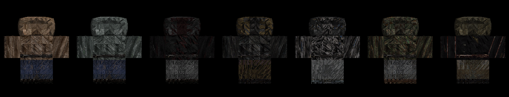

# STALKER Jackets — OBJ-броня для Minecraft 1.20.1 (Forge)

Мод добавляет 7 сталкерских курток. **Надеваешь один предмет в слот нагрудника —
получаешь визуально и по защите весь комплект**: голова, тело, руки и ноги рисуются
по OBJ-модели (`model/jacket.obj`) и анимируются вместе с игроком (ходьба, бег, приседы, взмахи рук).

*Слева направо: stalker, veteran, bandits, renegade, cs, freedom, dolg (вид спереди, рендер из OBJ).*

## Куртки

| Предмет (RU / EN) | Иконка | Текстура костюма | Броня | Прочность | Починка |
|---|---|---|---|---|---|
| Куртка сталкера / Stalker Jacket | `icon/2_jacket.stalker.png` | `tex/act_green_stalker1.png` | 7 | 320 | кожа |
| Куртка ветерана / Veteran Jacket | `icon/2_jacket.stalker2.png` | `tex/act_stalker_freedom_rookie.png` | 12 | 400 | кожа |
| Куртка бандита / Bandit Jacket | `icon/2_jacket.bandits.png` | `tex/act_stalker_bandit1b.png` | 10 | 352 | кожа |
| Куртка ренегата / Renegade Jacket | `icon/2_jacket.ren.png` | `tex/act_stalker_bandit1c.png` | 11 | 368 | кожа |
| Комбинезон «Чистого неба» / Clear Sky Suit | `icon/2_jacket.cs.png` | `tex/act_stalker_meutral1b.png` | 14 | 416 | железо |
| Куртка «Свободы» / Freedom Jacket | `icon/2_jacket.free.png` | `tex/act_stalker_freedom0.png` | 16 | 480 | железо |
| Комбинезон «Долга» / Duty Suit | `icon/2_jacket.dolg.png` | `tex/act_stalker_dolg___0.png` | 20 | 560 | алмаз |

Значения брони — уже за **полный сет** на одном предмете (для сравнения: полный сет
кожи — 7, железа — 15, алмазов/незерита — 20). Все куртки лежат в отдельной
творческой вкладке «Куртки сталкеров (OBJ)».

## Структура репозитория

- `model/jacket.obj` — исходная OBJ-модель (6 объектов: `head`, `chest`, `armL`, `armR`, `legL`, `legR`).
- `tex/*.png` — исходные текстуры костюмов 1024×1024 (17 шт., в мод встроены 7 по таблице выше).
- `icon/*.png` — иконки предметов 64×64.
- `src/` — исходники Forge-мода (mod id `stalkerjackets`).
- `docs/preview.png` — превью; `docs/preview_render.py` — скрипт, которым оно сделано.

## Как собрать

1. Поставь **JDK 17** (Gradle отдельно ставить не надо — wrapper скачает сам).
2. В корне репозитория запусти:
   - Windows: `gradlew.bat build`
   - Linux/macOS: `./gradlew build`
   (первая сборка долго качает Forge и зависимости — это нормально).
3. Готовый jar появится в `build/libs/` (имя вида `stalkerjackets-1.20.1-1.0.0.jar`).

Для запуска тестового клиента из исходников: `gradlew runClient`.

## Как установить

Нужен Minecraft **1.20.1** с **Forge 47.x**. Положи jar из `build/libs/` в папку `mods`
и запускай игру. Куртки — во вкладке «Куртки сталкеров (OBJ)».

## Как добавить новую куртку (есть текстура в `tex/`)

Пример: добавляем `tex/act_stalker_hero.png` как «Куртку Меченого»:

1. Скопируй текстуру и иконку в ресурсы мода:
   - `tex/act_stalker_hero.png` → `src/main/resources/assets/stalkerjackets/textures/entity/jacket_marked.png`
   - иконку (нарисуй/скопируй 64×64) → `src/main/resources/assets/stalkerjackets/textures/item/jacket_marked.png`
2. Создай `src/main/resources/assets/stalkerjackets/models/item/jacket_marked.json`
   по образцу соседних (поменяй имя текстуры).
3. В `JacketMaterial.java` добавь строчку enum'а, например:
   `MARKED("jacket_marked", 27, 15, 1.0F, 0.0F, 12, SoundEvents.ARMOR_EQUIP_IRON, () -> Ingredient.of(Items.IRON_INGOT), Rarity.RARE),`
4. В `ModItems.java` добавь регистрацию: `register(JacketMaterial.MARKED, false)`.
5. Добавь названия в `lang/ru_ru.json` и `lang/en_us.json`
   (`item.stalkerjackets.jacket_marked`) и строчку в `ModCreativeTab.java`.
6. Собери заново: `gradlew build` (`gradlew.bat build` на Windows).

## Как заменить OBJ-модель

Положи свой файл в `src/main/resources/assets/stalkerjackets/models/entity/jacket.obj`
(и обновить копию в `model/`). Требования:

- 6 объектов (`o ...`) с именами, содержащими: `head`, `chest`/`body`, `armL`, `armR`, `legL`, `legR`
  (регистр не важен; распознаются также `left_arm`, `right_leg` и т.п.);
- персонаж стоит прямо, ноги внизу, **перед смотрит в +Z** (как экспорт из Blender по умолчанию);
- треугольники с UV (`f v/vt/vn`); n-угольники триангулируются автоматически;
- масштаб любой — мод сам подгоняет рост под 32 пикселя модели игрока.

Если костюм в игре окажется задом наперёд — в `JacketArmorModel.java` поставь
`MIRROR_Z = true`. Быстро проверить соответствие «модель ↔ текстура» без запуска игры:
`python3 docs/preview_render.py` (нужен ImageMagick) — отрендерит все текстуры из `tex/`.

## Баланс

Все цифры — в `src/main/java/ru/objminecra/stalkerjackets/JacketMaterial.java`
(прочность-множитель, броня, стойкость, сопротивление отбросу, зачаруемость, звук, починка, редкость).
Прочность нагрудника = 16 × множитель.

## Права

Код мода — свободный (делай что хочешь). Текстуры и модель костюмов — фанатские,
происходят из S.T.A.L.K.E.R. (© GSC Game World): только для личного некоммерческого
использования, не для продажи и не для сборки в коммерческие проекты.
